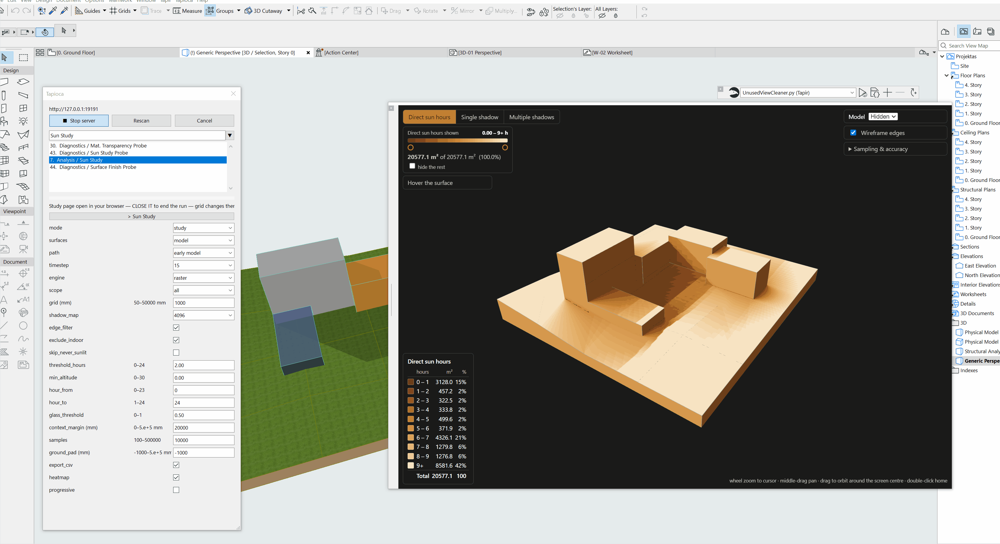
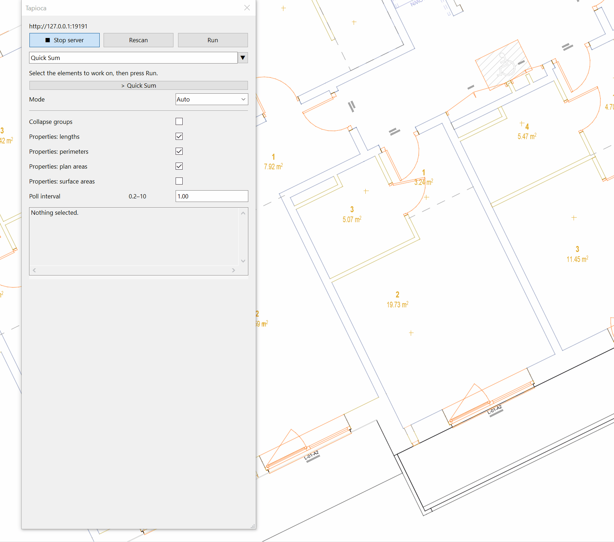
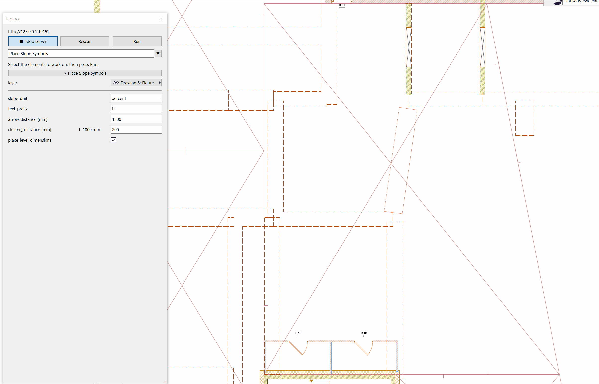
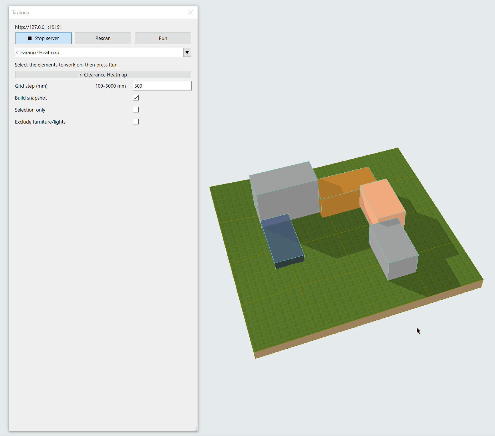

# Examples

These commands are small, complete Archicad workflows. They validate their scope,
batch native requests, handle partial results, and leave copyable output in the
Tapioca palette. They do not depend on the private development workspace or a
specific client project.

Run the examples from the palette after syncing the public command roots. The
same folders can be passed to `AddOn/EvP/tests/dryrun_command.py` for an offline
wire-level dry run.

## Included examples

| Example | What it demonstrates |
| --- | --- |
| `HelloCommand` | Palette text and bounded scalar inputs. |
| `CloudCompareConvert` | An out-of-process CloudCompare call that converts a point cloud to binary PLY. |
| `ArchicadAndTapirInfo` | Official Archicad Python API and Tapir calls through the Tapioca command bus. |
| `SelectionReport` | Selection reads, mixed-type Element IDs, and optional CSV output. |
| `PropertySummary` | Property resolution, one batched value read, missing values, and aggregation. |
| `ElementIdPrefix` | A preview-first, explicitly enabled model write with per-item results. |
| `SelectionGeometryInventory` | Selection-scoped 3D extraction and snapshot lifetime management. |
| `HorizontalSliceReport` | Horizontal geometry slicing and pure-Python area/perimeter measurement. |

For example, from `core/`:

```powershell
python AddOn/EvP/tests/dryrun_command.py Examples/SelectionReport
python AddOn/EvP/tests/dryrun_command.py Examples/ArchicadAndTapirInfo
python AddOn/EvP/tests/dryrun_command.py Examples/SelectionReport export_csv=1
python AddOn/EvP/tests/dryrun_command.py Examples/ElementIdPrefix apply_changes=1
python AddOn/EvP/tests/dryrun_command.py Examples/HorizontalSliceReport elevation=1.2
```

The dry run validates command discovery, parameter schemas, API request shapes,
and control flow. It does not replace a final run in Archicad for visual or model
behavior.

`ArchicadAndTapirInfo` intentionally calls `API.GetProductInfo`, the official
JSON command wrapped by `conn.commands.GetProductInfo()` in Graphisoft's
`archicad` package. It reaches that command through `tapioca.call()`. Palette
commands should use this unified bus instead of opening
a second `ACConnection` while Tapioca is already executing the command. Tapir is
reached the same way with the explicit `Tapir.*` namespace.

## More complex possibilities in action


Most Archicad native pickers are ported.


A test for Grasshopper file overlay over ArchiCADs viewport.


Preview analysis in WebUI with three.js.


Dynamically display selected-element quantities and derived calculations.


Create annotation geometry from selected roofs on a chosen layer.


Experimental plan and perspective overlays synchronized with Archicad views.


Calculate early-design metrics and publish a worksheet or PDF with model captures.
