[Made by and Architect, not a Programmer. Decisions are mine, but code is AI.]

# Tapioca


The steamed potato sidecar for ArchiCAD needs.
Tapioca is an UI for Python automation scripts.
Tapioca exposes more AC29 C++ SDK calls and can call upon Tapir and ArchiCAD python API if installed. Check examples for possibilities.

## Architecture and dependencies



Currently in testing waters phase.
Archicad remains the source of truth. Tapioca copies only the data required by a
command before downstream rendering or analysis. Diligent is compiled into the
native add-on; three.js is used only by browser-based viewers. Tapir extends the
available command surface when its add-on is installed.

## Download and install

Download **Tapioca-AC29.zip** from the [Releases page](https://github.com/keverza/tapioca-core/releases)
and extract the complete `Tapioca` folder to a permanent location. A repository
checkout is not required. Prerequisites are **64-bit Windows**, **Archicad 29**,
**PowerShell 5.1+**, the **x64 Visual C++ v14 Redistributable**, and internet access
for runtime/package downloads. With Archicad closed, run this from the extracted
`Tapioca` folder:

```powershell
powershell -NoProfile -ExecutionPolicy Bypass -File .\Install-Tapioca.ps1
```

The installer downloads/verifies the managed CPython 3.12 runtime and baseline
packages under `%LOCALAPPDATA%\Tapioca\runtime`, and installs starter commands
under `%LOCALAPPDATA%\Tapioca\Commands`. See [installation and prerequisites](dist/README.md)
for repair options and optional integrations. The flat binaries in `dist\` are
build pickups, not a complete installation; use `dist\Tapioca\` or the ZIP.

Then:

1. Open Archicad 29.
2. Open Options > Add-On Manager.
3. Choose Add and select the extracted Tapioca.apx. Keep EvPPy.dll and PyPackage beside it.
4. Open Tapioca Panel from the Tapioca menu, open a project, and press Rescan.
5. Run Hello Tapioca. Tapir is optional and needed only by commands that declare it.

## First command

```python
import tapioca

@tapioca.command(title="Hello", category="Examples")
def run(name: tapioca.Text = "Archicad"):
    tapioca.ui.text("Hello, " + name)
```

For a release installation, save it as
`%LOCALAPPDATA%\Tapioca\Commands\MyCommand\command.py` and press Rescan.
Repository authors can instead save under `Examples\`, run
`AddOn\EvP\Sync-Commands.ps1` from the repository root, and press Rescan. The
`Examples\` directory contains small runnable patterns for inputs, selection
reads, result tables, and built-in properties.

## Build from source

The build is Windows-only and requires Visual Studio with C++ tools. A clean
checkout can provision the declared dependencies and build AC29 with:

```powershell
powershell -File tools/build/provision-reference.ps1 -FromUpstream
powershell -File tools/build/Build-AddOn29.ps1
```

See `docs/architecture/commands/SPEC.md` and `docs/architecture/api/SPEC.md`
for the command and API contracts. Offline tests are documented in
`docs/guides/testing.md`.

## License

Tapioca is GPL-3.0-or-later. Third-party notices are in `NOTICE`.
